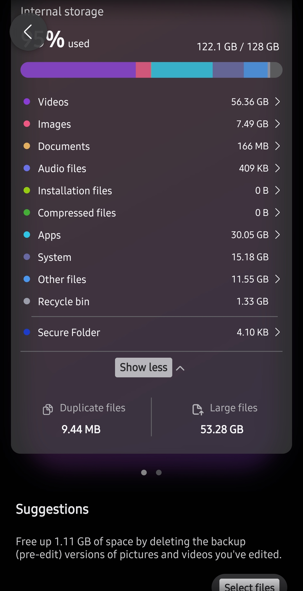
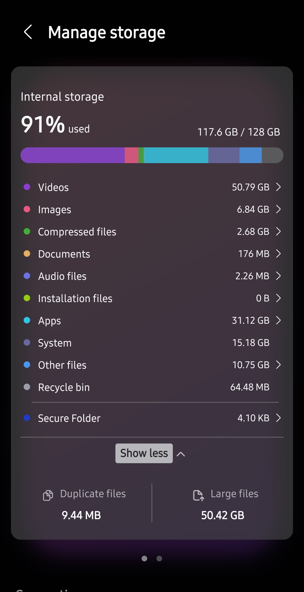

# archive_scripts

Compresses phone media of a specified month, or a start-and-end range of
months, to usable quality. Deletes originals only once the compressed
copy is verified, then zips the result. Runs entirely in Termux, no PC
involved.

- [Why this exists](#why-this-exists)
- [Usage](#usage)
- [Status](#status)
- [Known gaps](#known-gaps)
- [Docs](#docs)

## Why this exists

Kept direct on purpose — this is reasoning, not a pitch.

- Goal: free device storage without losing data.

  

  

  95% → 91%, after two months compressed so far. More checks are still
  running before the rest of the backlog gets zipped unattended.
- Two standard options, used together instead of picking one:
  - **Backup then delete.** Tradeoff: pulling data back later still
    costs data and time, even on cheap/zero-egress storage. Backup
    isn't zero-risk either (lost password, platform breach). Solved by
    also compressing instead of deleting outright.
  - **Compress and delete.** Tradeoff: no existing tool does this across
    a whole gallery unattended — it has to delete progressively as it
    compresses, or storing both copies at once fills the phone. Solved
    by this pipeline.
- Decision: back up originals off-device first (Backblaze B2, may front
  with Cloudflare for egress later) — separate from this pipeline, own
  safety net. Then compress locally to usable quality, delete original
  only after verify.
- One month at a time: keeps compressed and original data from mixing
  mid-run. WhatsApp media skipped — already compressed on send.

First version was one script doing everything per file. Died twice on
real runs, no way to tell what happened — Termux killed by Android
mid-run, logs were just narrative strings with nothing to reconstruct
state from.

Rewrite is built around one rule: **never trust anything that isn't
written down.** Every file's state lives in an append-only log. Nothing
is inferred from what's currently on disk. A crash is recoverable, not
a mystery.

## Usage

- `single_month_zipper.sh <YYYY-MM>` — compress, verify, delete-if-
  verified, zip one month.
- `multi_month_zipper.sh <start> <end>` — same, looped over a range of
  months.

Both self-relaunch into a detached `tmux` session with a wake-lock, so a
run survives Termux getting backgrounded or the screen locking. Full
pipeline detail is in [Docs](#docs) below.

## Status

Actively in use, not a finished tool. Two months (`2026-01`, `2026-04`)
have run clean end-to-end on real device data — confirmed by hand each
time, not yet trusted to run the rest of the backlog unattended.
`2026-03` — the one that originally exposed most of the bugs below — is
unblocked and next in line. The rest of the backlog (five months,
~38GB) follows after that.

(`January-2099.zip` is test fixture data, not a real month.)

Retry-on-failure exists now: a file that fails verify gets recompressed
automatically up to a cap before it's given up on as a real failure.

## Known gaps

- No automatic reconciliation on orphaned staged files — they're
  detected, but a human still has to look at each one.
- Paths and config are hardcoded for this one device. Fine for now,
  would need an `.env` before this runs anywhere else.
- Only proven under Termux/Android. Never tried in a plain Linux shell.

## Docs

- [architecture.md](docs/architecture.md) — full pipeline detail: state
  machine, verify barrier, what each log file is for.
- [archive-architecture.mermaid](docs/archive-architecture.mermaid) —
  same pipeline as a diagram.
- [sessions/](docs/sessions/) — session-by-session history: every bug
  found, decision made, and rewrite, in order.
