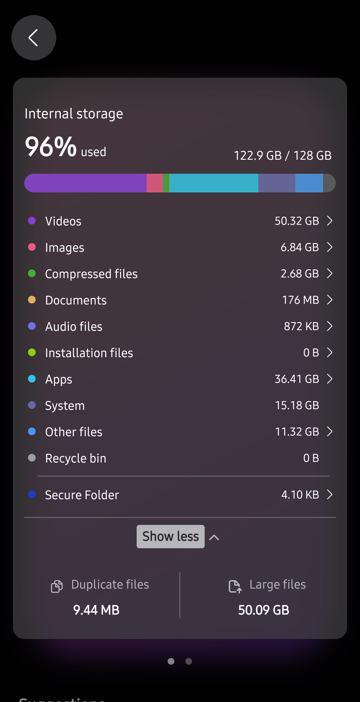
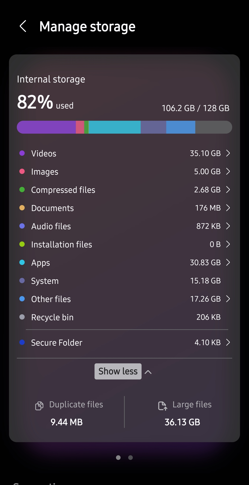
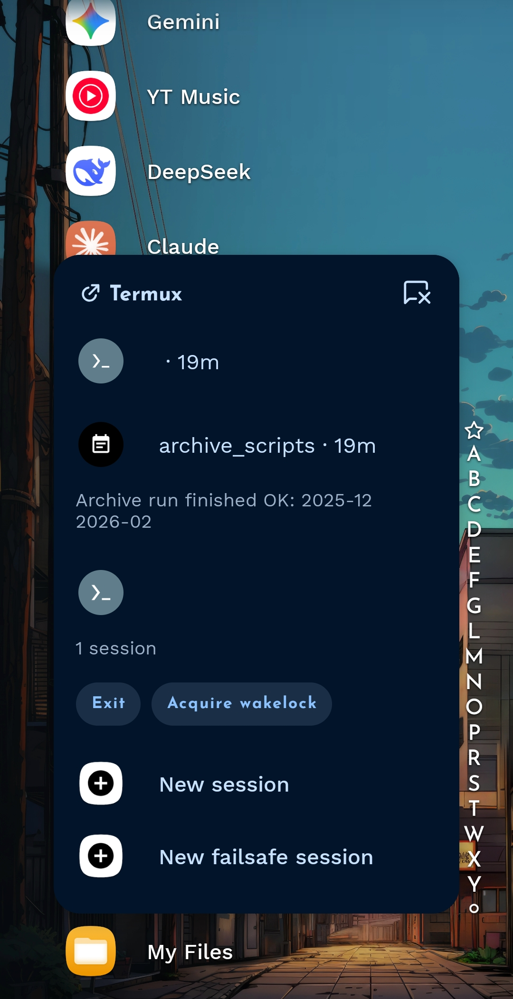
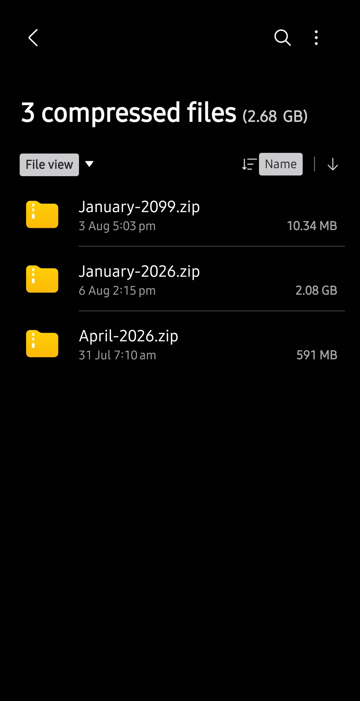

# archive_scripts

Compresses phone media of a specified month, or a list of months, to
usable quality. Deletes originals only once the compressed copy is
verified, then zips the result. Runs entirely in Termux, no PC
involved.

- [Why this exists](#why-this-exists)
- [Getting started](#getting-started)
- [Usage](#usage)
- [Status](#status)
- [Known gaps](#known-gaps)
- [Docs](#docs)

## Why this exists

Kept direct on purpose — this is reasoning, not a pitch.

- Goal: free device storage without losing data.

  

  

  82% resting state, spiking to 96% mid-run — staging and originals
  briefly coexist until each file is verified and the original is
  deleted. Staging clears back down after every run; the peak is
  expected, not a leak.
- Two standard options, used together instead of picking one:
  - **Backup then delete.** Tradeoff: pulling data back later still
    costs data and time, even on cheap/zero-egress storage. Backup
    isn't zero-risk either (lost password, platform breach). Solved by
    also compressing instead of deleting outright.
  - **Compress and delete.** Tradeoff: no existing tool does this across
    a whole gallery unattended — it has to delete progressively as it
    compresses, or storing both copies at once fills the phone. Solved
    by this pipeline.
- Decision: back up originals off-device first (Backblaze B2, may front
  with Cloudflare for egress later) — separate from this pipeline, own
  safety net. Then compress locally to usable quality, delete original
  only after verify.
- One month at a time: keeps compressed and original data from mixing
  mid-run. WhatsApp media skipped — already compressed on send.

First version was one script doing everything per file. Died twice on
real runs, no way to tell what happened — Termux killed by Android
mid-run, logs were just narrative strings with nothing to reconstruct
state from.

Rewrite is built around one rule: **never trust anything that isn't
written down.** Every file's state lives in an append-only log. Nothing
is inferred from what's currently on disk. A crash is recoverable, not
a mystery.

## Getting started

Dependencies (confirmed by grepping the actual scripts for external
command calls):

~~~
pkg install python tmux termux-api ffmpeg webp zip unzip
~~~

`termux-api` also needs the **Termux:API** companion app installed
separately (F-Droid) for `termux-wake-lock` and `termux-notification` to
work.

Clone (needs `git`, not a pipeline dependency, just how you get the code)
and run:

~~~
git clone https://github.com/okureanthonytonny-commits/archive_scripts
cd archive_scripts
./build_manifest.sh -a 90 /path/to/source/dir1 /path/to/source/dir2
./single_month_zipper.sh 2026-01
~~~

## Usage

- `build_manifest.sh [-o OUTPUT] [-a MIN_AGE_DAYS] DIR [DIR2 ...]` —
  scan directories, (re)build/extend `archive_manifest.tsv`. Safe to
  re-run: skips paths already recorded.
- `single_month_zipper.sh <YYYY-MM>` — compress, verify, delete-if-
  verified, zip one month.
- `multi_month_zipper.sh <YYYY-MM> [<YYYY-MM> ...]` — same, looped over
  a list of months. Skips a month whose zip already exists; on a real
  per-month failure, skips that month and continues (isolated fault),
  but stops outright on a systemic one (low disk space, or an
  anomaly-cancel choice) rather than repeating the same failure for
  every remaining month.
- `run_overnight.sh [<YYYY-MM> ...]` — wraps `multi_month_zipper.sh` for
  unattended runs: holds a wake-lock, runs detached in `tmux`, and on
  finish releases the wake-lock and kills its own `tmux` server so
  nothing keeps running or draining battery. If `termux-notification`
  is installed, it also fires a completion notification — useful since
  the whole point is not needing to check on it:

  

All three self-relaunch into a detached `tmux` session with a wake-lock
if not already inside one, so a run survives Termux getting
backgrounded or the screen locking. Full pipeline detail is in
[Docs](#docs) below.

## Status

Actively in use, not a finished tool, but the original backlog is
clear. Every real month (`2026-01`, `2026-03`, `2026-04`, `2025-12`,
`2026-02`) has now run end-to-end on real device data — the last two
(`2025-12`, `2026-02`) via a fully unattended overnight `run_overnight.sh`
run, after a 3/3 trust test on the other three confirmed unattended
mode was safe.

(`January-2099.zip` is test fixture data, not a real month.)

Retry-on-failure exists: a file that fails verify gets recompressed
automatically up to a cap before it's given up on as a real failure.
Pass 2 (verify) now also runs several files concurrently
(`MAX_PARALLEL_VERIFY`, same pattern as Pass 1's video compression),
since verify was serial-dispatch-bound, not I/O-bound.

## Known gaps

- No automatic reconciliation on orphaned staged files — they're
  detected, but a human still has to look at each one.
- Paths and config are read from `.env` (see `.env.example`) via
  `lib/config.sh`, so another device just needs its own `.env` —
  no code changes.
- Only proven under Termux/Android. Never tried in a plain Linux shell.
- No timeout on individual `ffmpeg` calls — a genuinely hung encode
  (distinct from a slow-but-progressing one) would never be caught.
  See `docs/sessions/issues.md`.

## Docs

- [architecture.md](docs/architecture.md) — full pipeline detail: state
  machine, verify barrier, what each log file is for.
- [archive-architecture.mermaid](docs/archive-architecture.mermaid) —
  same pipeline as a diagram.
- [sessions/](docs/sessions/) — session-by-session history: every bug
  found, decision made, and rewrite, in order.
